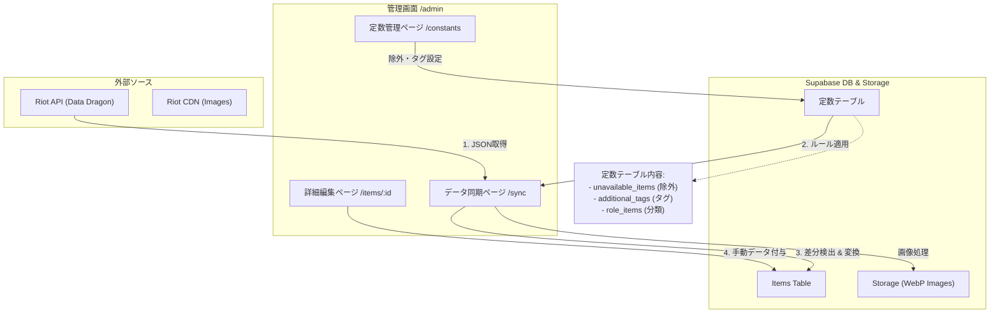

# 管理画面機能仕様書 / Admin Panel Design Spec

## 1. システム概要

本システムは、Riot GamesのLoLアイテムデータを管理し、付加情報（日本語訳、カスタムタグ等）を追加して公開するための管理インターフェースです。
「外部データの取り込み」と「独自データの管理」を明確に分離したアーキテクチャを採用しています。

### データフロー

---

## 2. データ管理戦略

データの「源泉（Source of Truth）」と「ライフサイクル」を以下の3つのレイヤーで管理します。

### Layer 1: 定数データ (Constants)
*   **役割**: データのフィルタリングやタグ付けの「ルール」を定義。
*   **管理場所**: `/admin/constants`
*   **保存先**: `unavailable_items`, `additional_tags`, `role_items` テーブル
*   **初期化**: `src/constants/seedData.ts` から初期投入されるが、以降はDBが正となる。
*   **反映タイミング**: データ同期処理 (`/sync`) 実行時に各アイテムへ適用される。

### Layer 2: API同期データ (Synced Data)
*   **役割**: Riot APIに基づく基本情報の維持。
*   **管理場所**: `/admin/sync`
*   **保存先**: `items` テーブル (自動更新フィールド)
*   **更新ポリシー**: 新しいパッチが来るたびに**上書き更新**される。
    *   対象: 名前, 価格, 画像パス, 派生関係, 元のタグ

### Layer 3: 手動編集データ (Manual Data)
*   **役割**: APIには存在しない独自情報の付加。
*   **管理場所**: `/admin/items/:id`
*   **保存先**: `items` テーブル (手動フィールド)
*   **更新ポリシー**: API同期が行われても**消えずに保持（マージ）**される。
    *   対象: 詳細なアビリティ説明, パッチステータス(Buff/Nerf), 人気チャンピオン, 有効フラグ

---

## 3. 機能・画面一覧

### 3.1 ダッシュボード (`/admin`)
*   **概要**: システムの状態を一目で確認できるランディングページ。
*   **主な機能**:
    *   登録アイテム総数、最終更新日の表示
    *   各機能へのクイックリンク

### 3.2 データ同期 (`/admin/sync`)
*   **概要**: Riot APIからのデータ取り込みを行うページ。
*   **主な機能**:
    *   最新バージョン取得
    *   データプレビュー（新規・更新・削除の差分表示）
    *   **一括同期実行**:
        1. 画像のダウンロード・リサイズ・WebP変換・アップロード
        2. 定数ルールの適用（除外、タグ付与）
        3. DBへのUpsert処理
        4. 既存の手動データの保護（マージ）

### 3.3 アイテム一覧・編集 (`/admin/items`, `/admin/items/:id`)
*   **概要**: 個別のアイテムデータを閲覧・編集するページ。
*   **主な機能**:
    *   検索・フィルタリング（名前、タグ、ステータス）
    *   詳細編集フォーム:
        *   アビリティ（Passive/Active）の構造化データ編集
        *   パッチステータス（Buff/Nerf/Rework等）の設定
        *   関連チャンピオンの紐付け

### 3.4 定数管理 (`/admin/constants`)
*   **概要**: データ変換ルールを管理するページ。
*   **主な機能**:
    *   **除外アイテム**: ゲーム内に存在しない、または表示不要なアイテムのID管理
    *   **追加タグ**: 特定のIDに対して自動付与する検索タグの管理
    *   **ロール分類**: 「ファイター用」「メイジ用」などのカテゴリ定義

---

## 4. テーブル設計概要

### `items` (Main)
| Column | Type | Description | Source |
| :--- | :--- | :--- | :--- |
| `riot_id` | text | Riot API上のID (PK) | API |
| `name_ja` | text | アイテム名 | API |
| `abilities` | jsonb | アビリティ詳細 (Array) | **Manual** |
| `patch_status` | text | Buff/Nerf等の状態 | **Manual** |
| `role_categories`| text[] | ロール分類 | Constants |
| `search_tags` | text[] | 検索用タグ | API + Constants |

### `unavailable_items` (Constant)
| Column | Type | Description |
| :--- | :--- | :--- |
| `riot_id` | text | 除外するアイテムID |
| `reason` | text | 除外理由 |

---

## 5. 技術スタック・制約

*   **画像処理**: クライアントサイド (Canvas API) で 32x32px WebP に変換してからアップロード。
*   **Riot API**: クライアントサイドから直接フェッチ（CORS回避のためプロキシが必要な場合あり、現状は直接/CDN利用）。
*   **Supabase**: DBおよびStorageへのアクセスは `supabase-js` を使用し、Row Level Security (RLS) で保護される想定（現フェーズでは開発用ポリシー）。
