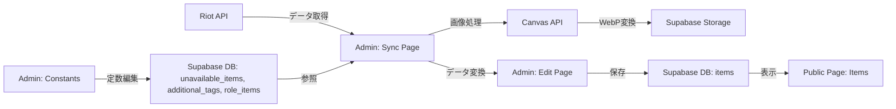

# 管理画面実装計画

## 概要

管理画面（Admin Dashboard）は、Riot API Data Dragonからアイテムデータを取得し、加工・編集してSupabaseに保存する機能を提供します。本計画では、必要な具体的機能とコンポーネントを詳細に定義します。

---

## 必要な機能一覧

### 1. データ同期機能（Riot API ⇄ Supabase）
Riot APIからアイテムデータを取得し、Supabaseへ保存・更新する機能。

#### 1.1 バージョン確認・取得
- **機能**: 最新のData Dragonバージョンを取得
- **API**: `https://ddragon.leagueoflegends.com/api/versions.json`
- **用途**: パッチ更新の検出、データ同期のトリガー

#### 1.2 アイテム一覧取得・プレビュー
- **機能**: 指定バージョンの全アイテムデータを取得
- **API**: `https://ddragon.leagueoflegends.com/cdn/{version}/data/ja_JP/item.json`
- **表示内容**: 
  - アイテムリスト（名前、ID、価格、画像プレビュー）
  - 現在DBに保存されているアイテムとの差分表示
  - 新規アイテム、削除されたアイテム、更新されたアイテムの識別

#### 1.3 画像処理・アップロード
- **機能**: アイテム画像をダウンロード、リサイズ、WebP変換、Supabase Storageへアップロード
- **処理フロー**:
  1. Riot CDNから画像を取得
  2. Canvas APIでリサイズ（32x32px）
  3. WebP形式に変換
  4. Supabase Storageバケット `item-images` へアップロード
  5. キャッシュ制御（1週間のCache-Control、手動リフレッシュ用タイムスタンプ）

#### 1.4 データ一括同期
- **機能**: 取得したアイテムデータをSupabase `items` テーブルへ一括保存・更新
- **処理ロジック**:
  - **新規アイテム**: 全データを登録（手動フィールドはnull）
  - **既存アイテム**: APIフィールドのみ更新、手動フィールド・`plaintext_ja`・`search_tags`は保持
- **UI**: 
  - 同期進捗バー
  - 同期結果サマリー（新規追加: N件、更新: M件、エラー: X件）

---

### 2. 定数管理機能

データ変換に使用する定数リスト（除外アイテム、追加タグ、ロール分類）を管理する機能。

#### 2.1 除外アイテム管理（`unavailable_items`）
- **機能**: ゲーム内で購入不可能なアイテムを登録・編集・削除
- **表示項目**: 
  - Riot ID
  - 除外理由（例: 「重複したヒュプリス」「廃止アイテム」）
- **UI**:
  - テーブル形式での一覧表示
  - 新規追加フォーム
  - インライン編集・削除

#### 2.2 追加タグ管理（`additional_tags`）
- **機能**: アイテムに手動で追加する検索タグを管理
- **表示項目**:
  - Riot ID
  - タグ（例: 「体力レシオ」「体力割合ダメージ」）
- **UI**:
  - アイテムIDで検索・フィルタ
  - 複数タグのまとめて登録

#### 2.3 ロール分類管理（`role_items`）
- **機能**: アイテムのロールカテゴリを管理
- **表示項目**:
  - ロール名（例: 「メイジ用」「ADC用」）
  - Riot ID
- **UI**:
  - ロール別グルーピング表示
  - ドラッグ&ドロップでのアイテム移動

---

### 3. アイテム個別編集機能

各アイテムの詳細データを手動で編集する機能。

#### 3.1 アイテム検索・一覧
- **機能**: Supabaseに保存されたアイテムを検索・一覧表示
- **フィルタ**:
  - 名前検索
  - ロールカテゴリ
  - パッチステータス（新規・バフ・ナーフ等）
  - 有効/無効
- **ソート**: 名前、価格、更新日時

#### 3.2 アイテム詳細編集
各アイテムの手動入力フィールドを編集するフォーム。

##### 編集可能フィールド:
1. **アビリティ（`abilities`）**
   - タイプ: パッシブ/アクティブ
   - 名前
   - 説明文
   - 複数アビリティのサポート
   - JSONエディタまたはフォーム入力

2. **パッチステータス（`patch_status`）**
   - 選択肢: buff / nerf / rework / removed / new / revived / adjusted / unchanged
   - ドロップダウンまたはラジオボタン

3. **ロール分類（`role_categories`）**
   - 複数選択可能
   - 選択肢: メイジ用、サポート用、ファイター用、タンク用、ADC用、アサシン用

4. **人気チャンピオン（`popular_champions`）**
   - チャンピオンID配列
   - 自動補完入力

5. **有効フラグ（`is_available`）**
   - チェックボックス

6. **短文説明（`plaintext_ja`）**（上書き可能）
   - テキストエリア

7. **検索タグ（`search_tags`）**（追加可能）
   - タグ入力UI

##### UI要素:
- リアルタイムプレビュー
- 保存・キャンセルボタン
- バリデーション表示

#### 3.3 画像手動リフレッシュ
- **機能**: 特定のアイテム画像を手動で再取得・アップロード
- **UI**: 各アイテム詳細画面に「画像を更新」ボタン

---

### 4. データ検証・テスト機能

#### 4.1 データ整合性チェック
- **機能**: データベース内のアイテムデータの整合性を検証
- **チェック項目**:
  - 画像パスの存在確認
  - 必須フィールドの欠損チェック
  - `build_from` / `build_into` の参照整合性

#### 4.2 フィルタテスト画面（既存機能の移行）
- **機能**: 現在の `/catalog` にあるフィルタテストを管理画面へ統合
- **表示内容**: フィルタリングロジックの動作確認、Raw JSONとの比較

---

## 必要なコンポーネント一覧

### ページコンポーネント

#### 1. `/admin` - ダッシュボード（既存）
- 概要カード: アイテム数、最終同期日時、エラー数
- クイックアクション: データ同期、新規アイテム追加、定数管理

#### 2. `/admin/sync` - データ同期ページ
- バージョン選択
- アイテムプレビュー・差分表示
- 一括同期実行ボタン
- 同期ログ・結果

#### 3. `/admin/items` - アイテム一覧・検索
- フィルタ・検索UI
- アイテムテーブル（ページネーション付き）
- 各行にクイック編集・削除ボタン

#### 4. `/admin/items/:id` - アイテム詳細編集
- フォーム（上記3.2の編集可能フィールド）
- プレビューエリア
- 保存・削除・キャンセル

#### 5. `/admin/constants` - 定数管理ページ
- タブまたはセクション:
  - 除外アイテム
  - 追加タグ
  - ロール分類

#### 6. `/admin/validation` - データ検証ページ
- 整合性チェック実行
- エラー一覧・修正提案

---

### UIコンポーネント

既存のデザインシステムを活用しつつ、以下を追加実装:

#### 1. `DataTable`
- ソート、フィルタ、ページネーション機能
- インライン編集サポート
- 使用場所: アイテム一覧、定数管理

#### 2. `ProgressBar`
- 同期処理の進捗表示
- 使用場所: データ同期ページ

#### 3. `MultiSelect`
- 複数選択ドロップダウン
- 使用場所: ロール分類、検索タグ

#### 4. `JsonEditor`
- JSONデータの編集・プレビュー
- 使用場所: アビリティ編集

#### 5. `ImageUploader`
- 画像アップロード・プレビュー
- 使用場所: アイテム画像の手動更新

#### 6. `StatusBadge`
- パッチステータス表示
- カラーコーディング（buff=green, nerf=red, new=blue等）

#### 7. `ConfirmDialog`
- 削除・上書き確認モーダル
- 使用場所: データ削除、一括更新

#### 8. `NotificationToast`
- 成功・エラー通知
- 使用場所: 保存完了、エラー発生時

---

## ユースケース別UIフロー

### ユースケース1: パッチ更新時のデータ同期

1. `/admin/sync` へアクセス
2. 最新バージョンを自動取得・表示
3. 「データをプレビュー」ボタンをクリック
4. 差分一覧を表示（新規・更新・削除）
5. 「同期を実行」ボタンをクリック
6. 確認ダイアログ表示
7. 同期処理開始（プログレスバー表示）
8. 完了後、サマリー表示
9. 必要に応じてエラーログを確認

### ユースケース2: 新規アイテムの手動情報入力

1. `/admin/items` へアクセス
2. 検索・フィルタで対象アイテムを特定
3. アイテム行をクリック → `/admin/items/:id` へ遷移
4. 各フィールドを編集:
   - アビリティをフォームで追加
   - パッチステータスを選択
   - ロール分類をチェック
5. プレビューで確認
6. 「保存」ボタンをクリック
7. 成功トースト表示、一覧へ戻る

### ユースケース3: 定数（除外アイテム）の管理

1. `/admin/constants` へアクセス
2. 「除外アイテム」タブを選択
3. 既存リストをテーブルで表示
4. 「新規追加」ボタンをクリック
5. フォームに Riot ID と理由を入力
6. 「追加」をクリック
7. テーブルに新しい行が追加される
8. 既存行の編集・削除も可能

---

## データフロー図

---

## 実装の優先順位

> [!NOTE]
> **実装フロー**  
> 各フェーズの最初に、そのフェーズで使用するUIコンポーネントを実装し、コンポーネントカタログに追加してレビューを行います。その後、実際のページ実装に進みます。

---

### Phase 3.1: データ同期基盤（最優先）

#### ステップ1: UIコンポーネント実装

Phase 3.1で使用する新規コンポーネント:

1. **ProgressBar** - 同期処理の進捗表示
   - プロパティ: `value` (0-100), `label`, `variant` (determinate/indeterminate)
   - 使用場所: データ同期中の進捗

2. **StatusBadge** - ステータス表示
   - プロパティ: `status` (new/updated/deleted/unchanged), `label`
   - カラーコーディング: new=blue, updated=yellow, deleted=red
   - 使用場所: 差分一覧での変更種別

3. **ConfirmDialog** - 確認ダイアログ
   - プロパティ: `title`, `message`, `onConfirm`, `onCancel`, `variant` (danger/warning/info)
   - 使用場所: 同期実行前の確認

4. **NotificationToast** - 通知トースト
   - プロパティ: `message`, `type` (success/error/warning/info), `duration`
   - 使用場所: 処理完了・エラー通知

**実装順序**:
- [ ] ProgressBar コンポーネント実装
- [ ] StatusBadge コンポーネント実装  
- [ ] ConfirmDialog コンポーネント実装
- [ ] NotificationToast コンポーネント実装
- [ ] コンポーネントカタログへ追加
- [ ] **👤 ユーザーレビュー: コンポーネント確認**

#### ステップ2: ページ実装

基盤ユーティリティ（既存）:
- [x] Riot API 取得ユーティリティ
- [x] 画像処理ユーティリティ
- [x] Supabase Storage アップロード
- [x] アイテムデータ保存・更新処理

データ同期ページ（`/admin/sync`）実装:
- [ ] バージョン取得・表示機能
- [ ] アイテムプレビュー機能
- [ ] 差分検出ロジック（新規・更新・削除の判定）
- [ ] 一括同期UI・実行フロー
- [ ] エラーハンドリング・ログ表示
- [ ] **👤 ユーザーレビュー: データ同期ページ**

---

### Phase 3.2: アイテム管理UI

#### ステップ1: UIコンポーネント実装

Phase 3.2で使用する新規コンポーネント:

1. **DataTable** - データテーブル
   - プロパティ: `columns`, `data`, `sortable`, `filterable`, `pagination`
   - 機能: ソート、フィルタ、ページネーション
   - 使用場所: アイテム一覧、定数管理

2. **MultiSelect** - 複数選択ドロップダウン
   - プロパティ: `options`, `value`, `onChange`, `placeholder`
   - 機能: チェックボックス付きドロップダウン、選択済みバッジ表示
   - 使用場所: ロール分類、検索タグ

3. **JsonEditor** - JSON編集エディタ
   - プロパティ: `value`, `onChange`, `schema`, `readonly`
   - 機能: シンタックスハイライト、バリデーション、フォーマット
   - 使用場所: アビリティ編集

4. **ImageUploader** - 画像アップロードUI（オプション）
   - プロパティ: `onUpload`, `preview`, `maxSize`
   - 機能: ドラッグ&ドロップ、プレビュー
   - 使用場所: アイテム画像の手動更新

**実装順序**:
- [ ] DataTable コンポーネント実装
- [ ] MultiSelect コンポーネント実装
- [ ] JsonEditor コンポーネント実装
- [ ] ImageUploader コンポーネント実装（オプション）
- [ ] コンポーネントカタログへ追加
- [ ] **👤 ユーザーレビュー: コンポーネント確認**

#### ステップ2: ページ実装

アイテム一覧ページ（`/admin/items`）:
- [ ] DataTable を使用したアイテム一覧表示
- [ ] 検索・フィルタ機能（名前、ロール、パッチステータス）
- [ ] ソート機能（名前、価格、更新日時）
- [ ] ページネーション
- [ ] 詳細画面への遷移

アイテム詳細編集ページ（`/admin/items/:id`）:
- [ ] アイテムデータ取得・表示
- [ ] 編集フォーム実装（全フィールド）
- [ ] アビリティエディタ（JsonEditor使用）
- [ ] MultiSelectでロール分類・タグ選択
- [ ] リアルタイムプレビュー
- [ ] 保存・キャンセル機能
- [ ] **👤 ユーザーレビュー: アイテム管理UI**

---

### Phase 3.3: 定数管理UI

#### ステップ1: UIコンポーネント実装

Phase 3.3で使用するコンポーネント:
- DataTable（Phase 3.2で実装済み）
- その他既存コンポーネント（Input, Button, Select等）

**新規コンポーネント不要** - 既存コンポーネントのみで実装可能

#### ステップ2: ページ実装

定数管理ページ（`/admin/constants`）:
- [ ] タブナビゲーション実装
- [ ] 除外アイテム管理UI（DataTable使用）
  - CRUD機能（追加・編集・削除）
- [ ] 追加タグ管理UI（DataTable使用）
  - CRUD機能
- [ ] ロール分類管理UI（DataTable使用）
  - CRUD機能
- [ ] **👤 ユーザーレビュー: 定数管理UI**

---

### Phase 3.4: 補助機能

#### ステップ1: UIコンポーネント実装

Phase 3.4で使用するコンポーネント:
- 既存コンポーネントのみで実装可能

**新規コンポーネント不要**

#### ステップ2: ページ実装

データ検証ページ（`/admin/validation`）:
- [ ] 整合性チェックロジック実装
- [ ] チェック実行UI
- [ ] エラー一覧表示
- [ ] 修正提案機能

ダッシュボード拡充（`/admin`）:
- [ ] 統計情報カード（アイテム数、最終同期日時等）
- [ ] クイックアクションリンク
- [ ] **👤 ユーザーレビュー: 補助機能**

---

## 技術的考慮事項

### 1. パフォーマンス
- 大量画像の並行処理制限（同時5件まで等）
- データベースクエリの最適化（インデックス活用）
- ページネーションの実装

### 2. エラーハンドリング
- Riot API レート制限対応
- ネットワークエラー時のリトライ
- 部分的な同期失敗時のロールバック

### 3. 認証・認可
- 管理画面へのアクセス制限（Supabase Auth）
- 現時点ではスキップ可、将来的に追加

### 4. 状態管理
- React Context または Zustand で同期状態を管理
- 楽観的UI更新

## 次のステップ

> [!IMPORTANT]
> **Phase 3.1 の開始**
> 
> まずは **Phase 3.1: データ同期基盤** から着手します。
> 
> **実装フロー**:
> 1. **ステップ1**: 必要なUIコンポーネント4つ（ProgressBar, StatusBadge, ConfirmDialog, NotificationToast）を実装
> 2. コンポーネントカタログに追加
> 3. **👤 ユーザーレビュー**: コンポーネントのデザイン・動作確認
> 4. **ステップ2**: データ同期ページ（`/admin/sync`）を実装
> 5. **👤 ユーザーレビュー**: ページ全体の動作確認
> 
> この流れで進めて問題ありませんか？

